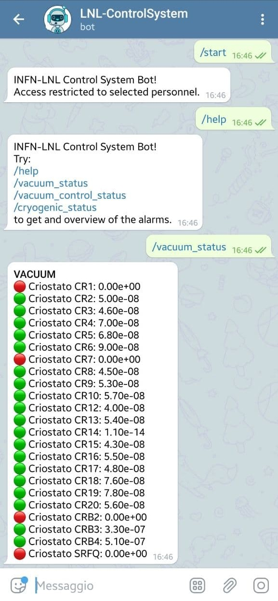
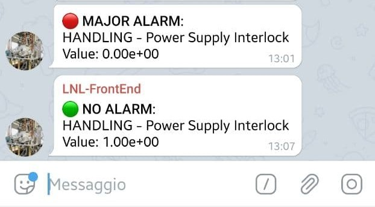

# Telegram EPICS bot

A simple Telegram bot to read EPICS control systems PVs and to be notified about alarms.

## Usage

This bot can reply to authenticated users about the status of groups of PVs:



and can send a notification when one PV enters or exits the alarm state.




## Setup

### Prerequisites

```bash
pip install -r requirements.txt
```

### The configuration json file

Now create your bot configuration file. Look at ``example.json`` for a template.

```json
{
    "bot_token": "...",
    "bot_name": "Control System Bot!",
    "antibounce": 10,
    "users": {
        "user1": 123456789,
        "user2": 987654321,
        "group1": -123978456
    },
    "subscriptions": {
        "example_subsystem": [
            "user1",
            "group1"
        ]
    }
}
```

where:

* ``bot_token`` is the Telegram Bot access token, to be generated with @BotFather on a Telegram client.
* ``bot_name`` is the desired bot name to be shown on the help.
* ``antibounce`` is the delay in seconds to wait before sending alarms notifications. The notification is sent only if the alarm persists for more than ``antibounce`` seconds.
* ``users`` is a list of know Telegram user IDs, who can talk to this Bot. All other users will get an ``unathorized`` message, stating their ID. They should send this ID to the bot admin to be included in this list. This field can also include IDs of Telegram groups.
* ``subscriptions`` is used to specify who will receive notifications for each group of PV alarms. Let's create a new group of PVs called ``example_subsystem``: the users ``user1`` and ``group1`` will receive notification of alarms from the PVs belongin to this group. The users and their IDs must be specified in the ``users`` tag. Multiple groups can be specified.

### PV configuration

To specify the PVs belonging to a certain group, as defined in the ``json`` file, the ``xml`` files in the ``config`` folder are used. The program will look for an ``xml`` file with the same name of the group. For example, for the ``example_subsystem`` the ``config/example_subsystem.xml`` will be used.

These files must adhere to the following structure.

```xml
<component name="Subsystem Name">
    <pv name="pv1_name">
        <description>PV1 description string</description>
    </pv>
    <pv name="pv2_name">
        <description>PV2 description string</description>
    </pv>
</component>
```

where each PV with a description is provided. The Bot will use the alarm status of each PV to show and notify alarms.

The schema of these files is compatible with the EPICS Archiver files, which can be used directly here.

### Running

Now run:

```bash
python epics_bot.py example.json
```

A restart is required to reload the configuration files.

## Testing

A test PV server is provided in the ``test`` folder, based on [pcaspy](https://pcaspy.readthedocs.io/en/latest/). The ``test.json`` configuration file can be used as a template to run the bot against these dummy PVs, just set the user ID and the bot token. Then run:

```bash
python test/dummy_pv_server.py &
python epics_bot.py test/test.json
```
